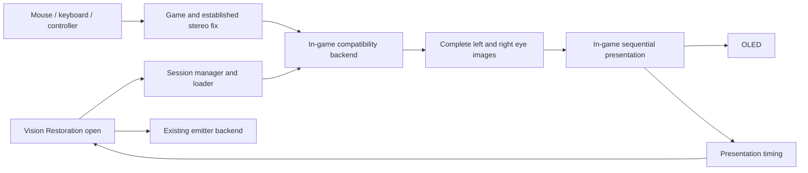

# App-hosted 3D Vision compatibility

Updated 2026-09-15. **A shared in-process game hook is allowed.** The user objects
to game-specific adjustments. Our earlier interpretation banning attachment was
incorrect. Reuse established community fixes and implement a common Geo11 output
integration, preserving the game's original window and input. The previous
deployments remain withdrawn and rolled back; their manual setup changes and
unresolved timing do not establish the requested compatibility. See
[current status](STATUS.md).

## Product requirements

- Open Vision Restoration, then play an existing 3D Vision game with its established
  fix or stereo mod. Our app may remain open and own the emitter.
- Keep the game's actual window, focus, mouse, keyboard and controller input.
- Receive full eye images and present them inside the game's graphics path.
- Preserve and reuse existing fixes, shader overrides and convergence settings.
- Implement shared loading/output behavior selected by architecture and supported
  graphics interfaces. Do not add game-name branches or change a title's fix,
  shader corrections, compatibility options or graphics settings to make our hook
  pass. Common connection changes must be explicit, reversible and preserve the
  established fix. Report unsupported integration cases with their actual cause.
- Keep the current graphics driver. No downgrade or replacement driver.
- Keep window capture and AI desktop as useful independent features.
- SBS window capture is the last-resort game route. It is not the main architecture.
- Remove the failed Spout and Blender viewport inputs.
- OLED is the working display baseline at 120 Hz and 240 Hz with BFI in the user's
  setup. Record each actual sequence/profile; defer LCD work.

This supersedes the earlier requirement that no control app remain running and
the initial capture-first proposal. An app-owned runtime is now explicitly wanted.
The withdrawn prototype used early loading through normal game launches. A
supported shared activation route and broader wrapper compatibility still need
validation.

## How the original system fitted together

NVIDIA's automatic stereo driver duplicated selected render targets and draws,
modified projection for each eye and used game profiles to control its behavior.
Other applications supplied eye views themselves. Display and glasses timing
completed the system. That is why restoring only the emitter cannot restore every
game's stereo rendering.
[NVIDIA's original developer guide](https://developer.download.nvidia.com/whitepapers/2010/3D_Vision_Best_Practices_Guide.pdf).

## Architecture

The app owns configuration, tested profiles, activation and USB. The in-game
backend owns stereo resources and physical presentation for that game window.
The host receives timing and status, not a mandatory screen capture. There is one
active emitter owner, and one physical presenter per output window.

### 1. Session manager and loader

Support x86 and x64 backends selected by the game executable. Identify the actual
game process through launchers. Load before graphics-device creation whenever the
stereo backend needs to intercept resource creation or initial stereo queries.

A process watcher that attaches after the first Present cannot reliably retrofit
all stereo resources. Start with a controlled early-load proof. Establish ordinary
shortcut/launcher attachment next; use an app launch entry where early attachment
cannot otherwise be guaranteed. Already-running unsupported sessions should say
that a game restart is needed.

Attach to configured game profiles while the app is enabled. Inventory existing
d3d9/d3d11/dxgi/nvapi wrappers and their versions first. Reuse their supported
loader/chaining mechanisms; do not load two competing stereo engines or overwrite
a community fix's DLL/configuration blindly. Keep shader hashes, include paths,
constants, command lists and fix hotkeys intact.

A session lease ties activity to the host's PID, lifetime and heartbeat. On host
exit/loss, stop emitter commands and leave stereo presentation at a defined GPU
boundary. Return to mono where the backend supports it; otherwise require game
restart. Do not unload a DLL while the game's threads still call its hooks.

### 2. Stereo compatibility backends

These categories need different work even though they share the output system:

| Existing content | Missing work | Initial route |
|---|---|---|
| Game renders both eyes through NVAPI Direct Mode | Implement the stereo API/resource behavior it expects and route each eye correctly. | Native stereo compatibility backend. |
| DX11 game with a 3Dmigoto/Helix fix dependent on automatic stereo | Supply geometry stereo and the fix's expected shader/stereo parameters. | Evaluate Geo11 compatibility with that existing fix. |
| Already functioning Geo11 game | Broaden game/load/transition validation. | Implemented full-resolution Geo11 output/resource adapter. |
| DX9/10 legacy fixes | Preserve their API-specific rendering and mod conventions. | Separate legacy backend; evaluate relevant existing wrappers. |
| Modern native stereo / geometry mods | Consume their completed eyes through the actual API and provider interface. | Dedicated DX12/Vulkan/etc. adapter. |
| DX12 ReShade stereo shader | Access its stereo texture and integrate presentation. | ReShade output adapter, independent of legacy NVAPI emulation. |
| Stereo media player | Accept its stereo rendering interface or decoder eye images. | VLC 3.x direct SBS/TAB decoder source implemented; other player adapters remain future work. |

NVAPI compatibility must implement real behavior: capability queries, handles,
activation, separation/convergence, eye selection and the applicable resource
semantics. Forward unrelated NVAPI functionality to the actual implementation.
Advertising stereo support without allocating/routing the eye resources is not
a compatibility backend. NVIDIA documents that SetActiveEye selects the left or
right backbuffer in Direct Mode.
[NVAPI stereo API](https://docs.nvidia.com/nvapi/group__stereoapi.html).

Classic 3Dmigoto's NVAPI wrapper forwards important stereo operations to NVIDIA.
Therefore accepting a shader fix or intercepting Present alone does not recreate
the missing automatic stereo engine.
[3Dmigoto NVAPI wrapper](https://github.com/bo3b/3Dmigoto/blob/master/NVAPI/DllMain.cpp).

Geo11 supplies stereo rendering for the implemented DX11 backend. Its author documents enabling
direct mode and preserving an existing fix's d3dx.ini when upgrading. This offers
a route to reuse many fixes, not proof that every historical fix works unchanged.
The adapter uses its full-resolution `katanga_vr` resource interface inside the
game process; no external Katanga viewer or SBS window capture is required.
[Geo11 maintained instructions](https://helixmod.blogspot.com/2022/06/announcing-new-geo-11-3d-driver.html).

### Prior art to evaluate

| Project | Relevant evidence | Limit of that evidence |
|---|---|---|
| [Geo11](https://helixmod.blogspot.com/2022/06/announcing-new-geo-11-3d-driver.html) | Replacement DX11 stereo rendering and reuse of established fixes; several output modes. | Output tested in two games; sustained-load and broader-fix tests remain. No native DX12 coverage. |
| [wiz3D](https://github.com/effcol/wiz3D) | Open stereo wrapper with native 3D Vision/HD3D handling and explicit per-game results. | Its compatibility table is not a proof of support for all Helix/3Dmigoto fixes. |
| [3DVision4All](https://github.com/oneup03/3DVision4All) | Existing NVIDIA stereo/output integration and legacy API work. | Its documented routes retain GPU/driver dependencies; not a drop-in driver-independent renderer. |
| [iZ3D](https://github.com/bo3b/iZ3D) | Stereo wrapper, injector and output-method architecture. | Old code and loading mechanisms need a modern audit. |
| [Super-VRExport-Addon](https://github.com/BerZerker96/Super-VRExport-Addon) | Documents full-resolution SuperDepth3D texture export on DX11/DX12. | Transport reference only; Geo-3D is distinct from Geo11, and no compatibility test was run here. |

Pin versions, inspect actual source/license and reproduce the relevant route
before adopting a backend. Do not call an upstream README claim our own test.

### 3. In-game output

Feed completed full-resolution eyes into a presenter integrated with the game's
window. The game retains input ownership and logical client dimensions. Preserve
existing source cursor/HUD fixes. Do not halve mouse coordinates just because an
intermediate texture is packed.

A producer can internally use a full-resolution packed GPU texture; that does not
require an SBS desktop or an external viewer. Prefer explicit eye resources.
Packing, per-eye dimensions and display aspect are separate metadata.

The difficult part is presentation ownership. Calling Present several extra times
can change the game's backbuffer index, fences and pacing. The current failed
hook already illustrates why this cannot be treated as a trivial final shader.
Provide a real API-specific ownership model with correct swapchain/device lifetime,
resize, resource states, queue synchronization and shader-state restoration.

Acquire a completed pair at a full stereo-cycle boundary. Retain it across both
eyes and intervening black frames. Keep display cadence independent of game
simulation/source rate. Prove 30/45/60-pair sources, stalls and GPU load. Do not
alternate the glasses blindly while the display repeats the wrong eye.

Carry format, transfer function, primaries, SDR white and HDR state. Keep exactly
one presentation owner; an app fullscreen preview must suspend the game session.
Preserve the proven OLED timing profiles.

The native OS cursor and software cursor need separate tests. Keeping the original
window solves the focus architecture; it does not automatically fix a game's
incorrect cursor depth, HUD shaders or raw-input bugs.

## Implemented backend and remaining gaps

- `runtime/geo11_loader.cpp` establishes hook order before loading the unchanged
  community renderer. Both x86 and x64 use ordinary game startup.
- `runtime/geo11_output.cpp` separates game Present from physical display Present,
  retains complete pairs, and reports timing to `src/gamesync.cpp`. Transfer uses
  keyed mutexes or shared GPU fences. Output queues three refreshes and does not
  wait on the game's producer mutex.
- `src/stereo_compatibility.cpp` backs up and connects existing fixes. UI and CLI
  share architecture/conflict/preservation checks, with no game-name branches.
  Game executables and shader fixes are not patched.
- The existing v1 timing channel remains. Native stereo/resource backends may
  need a richer versioned contract.
- `adapters/vision_hook.cpp` and its ReShade installer are historical experiments.
  The current UI inspects fixes and removes old adapters; it does not enable the
  withdrawn Geo11 connector.
- Native NVAPI stereo, DX9/10, native DX12 and other media-player adapters remain
  unimplemented. VLC 3.x now supplies timed SBS/TAB video directly to the app
  presenter; see [VLC setup and test scope](USAGE.md#vlc-stereo-movies).
  There is no established-fix compatibility database in this app.
- Multiple games/swapchains, unusual DXGI methods, HDR metadata and sustained
  load need broader testing. Counters alone do not prove optical quality.
- Spout and Blender inputs were removed; window capture and AI desktop remain.

## Work order and acceptance

1. **Preserve the working app and remove unwanted inputs.** Keep image/window/AI
   sources and OLED behavior. Build and verify the retained paths.
2. **Prove direct eye access and presentation.** Use a controlled native stereo
   test and one Geo11 game with an established fix. First demonstrate correct
   independent eyes in the original game window, then timing/glasses. No window
   capture counts toward this milestone.
3. **Prove the native API contract.** Log stereo API calls and unsupported operations
   for one actual native 3D Vision game. Verify eye selection, device reset and
   parameter changes against an explicit compatibility implementation.
4. **Make activation app-controlled.** Prove x86/x64 early loading, startup through
   a launcher, repeated sessions, host exit and clean recovery. Keep original fix
   files intact. A manual test adapter is not proof of automatic attachment.
5. **Extend coverage by backend.** DX9/10 fixes, additional DX11 fixes, native games,
   modern geometry mods and ReShade each get actual game tests.
6. **Player integration.** Reuse compatible stereo APIs where available; test VLC
   and other renderers individually. Their 2D controls/subtitles need correct
   composition. Ordinary player output does not automatically implement NVAPI.

For every game record API, x86/x64, provider/version, fix files, automatic-versus-
native stereo, loader route, eye access, image accuracy, inputs, source/output
rates, HDR, resize/Alt-Tab, host lifecycle, timing and optical results.

**All existing 3D Vision games and mods is the coverage target, not a promise from
one successful hook.** Driver-generated stereo, native stereo and different
graphics APIs have different dependencies. Keep unsupported cases visible; do not
silently replace them with AI reconstruction or SBS capture.

## Retained fallback features

Window capture remains available for applications that already display SBS/TAB.
A future aligned, nonactivating overlay can improve single-screen capture input.
Capture the source HWND, preserve logical coordinates and handle source occlusion.
Do not split a player's entire toolbar as if it were stereo video.

AI desktop remains its own useful conversion mode. It is not a substitute for the
game's established geometry-stereo fix. Spout and Blender are not offered as inputs.
